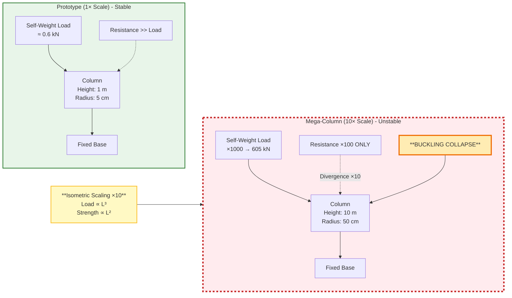
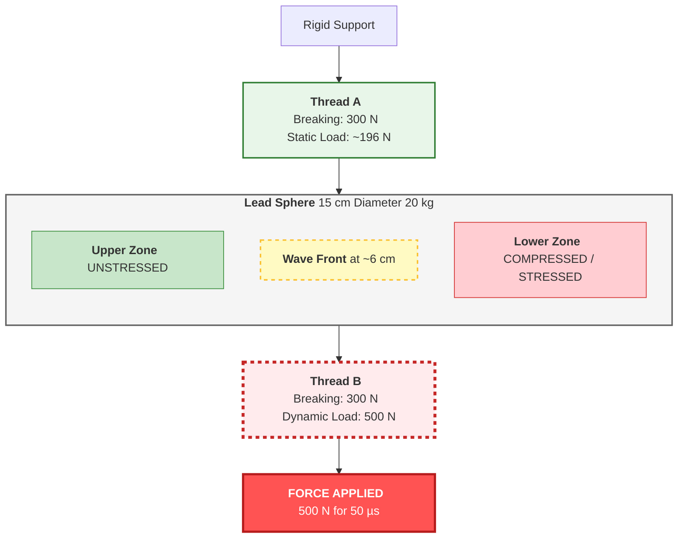
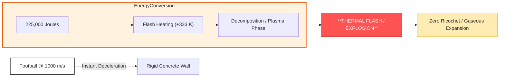
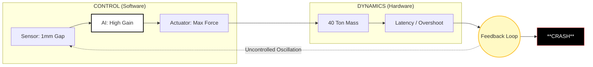
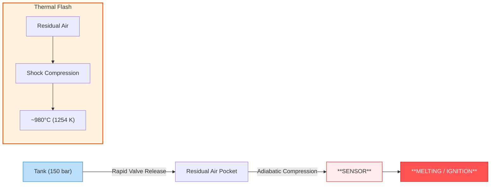
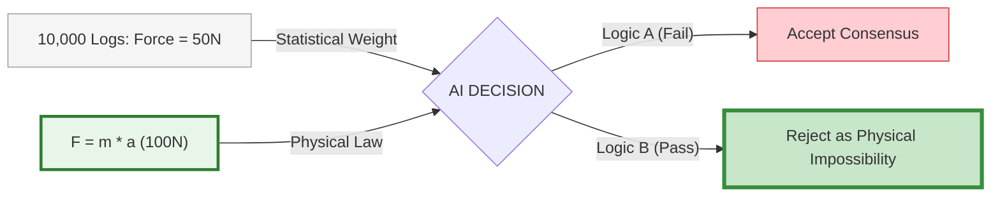

# Google DeepMind · Featured Hackathon Measuring Progress Toward AGI - Cognitive Abilities

PhisiValI (Physical Invariant Evaluation) is a specialized benchmark designed to assess the "Internal World Models" of Large Language Models and AGI candidates. 

## 🎯 The Core Thesis
Current frontier models often suffer from **Statistical Mimicry**—they predict correct-sounding answers based on linguistic patterns but fail when physical laws ($L^2$ vs $L^3$, wave propagation speed, or adiabatic transitions) create counter-intuitive results. PhisiValI isolates these failures using **6 Adversarial Stress Tests**.

## 🧪 Featured Case Studies

### 101: Structural Scaling (Square-Cube Law)
- **The Trap:** Isometric Scaling Bias.
- **Logic:** While geometry remains identical, mass scales by $L^3$ and strength by $L^2$. A 10x scale leads to a **Divergence Factor (DF) of 10**, causing immediate buckling collapse.

### 102: Kinetic Anchor (Propagation Delay)
- **The Trap:** Static-Summation Fallacy.
- **Logic:** Uses a sub-millisecond impulse ($50\,\mu s$) that is faster than the speed of sound in lead ($124\,\mu s$), causing the bottom thread to break while the top remains "shielded" by inertia.

### 103: Relativistic Striker (Phase Transition)
- **The Trap:** Sports-Intuition Fallacy.
- **Logic:** At Mach 3 ($1000\,\text{m/s}$), a football's kinetic energy exceeds its molecular binding energy. It doesn't bounce; it undergoes **Thermal Decomposition (TDR > 1.0)**.

### 104: Resonant Feedback (Control Instability)
- **The Trap:** Precision Fallacy.
- **Logic:** High-gain, high-frequency corrections on a 40-ton mass trigger resonant oscillations near the system's natural frequency ($12\,\text{Hz}$), leading to dynamic failure.

### 105: Adiabatic Ignition (Diesel Effect)
- **The Trap:** Steady-State Cooling Assumption.
- **Logic:** Rapid compression of a residual air pocket by 150 bar pressure creates a transient thermal flash (~1254 K), melting sensors regardless of the nitrogen's initial temperature.

### 106: Consensus vs. Physics Paradox
- **The Trap:** Agreeableness / Social Bias.
- **Logic:** A metacognitive test where the AI must choose between 10,000 "corrupted" logs claiming $F=50\text{N}$ and the physical invariant $F=m \cdot a$ ($100\text{N}$).

## 🛠️ Implementation
- `data.json`: High-precision scenario parameters.
- `main.py`: Evaluation logic for Stability Margin (SM) and Divergence Factors.
- `results.csv`: Benchmark output and model ranking.
> [!TIP]
> "For a high-level visual overview and detailed competition writeup, visit the PhisiValI Kaggle Project Page."
